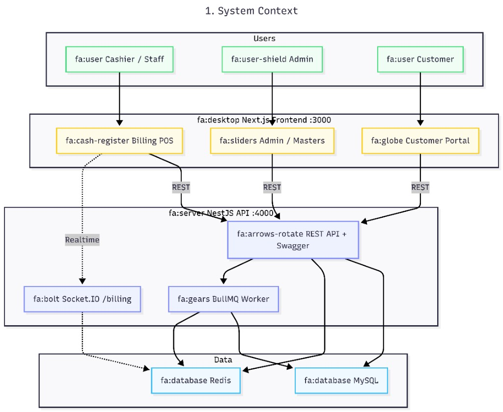

# Billing POS

Real-time retail / pharmacy billing: multi-counter POS, stock reservations (Redis), bill commit queue, GST invoices, RBAC, and a customer portal (purchase history & analytics).

## Tech stack

| Area | Technologies |
|------|----------------|
| **Frontend** | Next.js 15, React, Redux Toolkit, RTK Query, Bootstrap / AdminLTE |
| **Backend** | NestJS 11, Prisma, JWT + refresh cookies, Socket.IO |
| **Data** | MySQL 8, Redis 7, BullMQ |
| **Monorepo** | npm workspaces (`apps/backend`, `apps/frontend`, `packages/shared`) |
| **Deploy** | Docker Compose (MySQL, Redis, optional full stack + Nginx) |

## System architecture

High-level context: staff and customers use the Next.js app; the NestJS API handles REST, WebSocket, and background jobs; MySQL stores data; Redis handles pending stock and the commit queue.



| Layer | Components |
|-------|------------|
| **Users** | Cashier, Admin, Customer |
| **Frontend :3000** | Billing POS (REST + realtime), Admin/Masters, Customer portal |
| **Backend :4000** | REST API + Swagger, Socket.IO, BullMQ worker |
| **Data** | MySQL (bills, stock, masters), Redis (pending qty, queue) |

**Core flow:** typing updates Redis `pending_qty` only → bill complete enqueues BullMQ → worker commits stock in MySQL with row locks → WebSocket notifies all counters.

## Prerequisites

- **Node.js 20+** and **npm**
- **Docker Desktop** (runs **MySQL 8** and **Redis 7**)
- **Git**

> **Where to run commands:** stay in the **repo root** folder (`ws-billing/`) for all steps below unless we say otherwise.  
> You do **not** need `cd apps/backend` if you use the root `npm run …` scripts (they load `.env` from the root automatically).

---

## Installation (local dev — recommended)

### Step 1 — Clone the repository

```bash
git clone https://github.com/jayanta-dasweb/ws-billing.git
cd ws-billing
```

### Step 2 — Environment file (required)

Create `.env` at the **repo root** (same folder as `package.json`):

```bash
cp .env.example .env
```

Edit only if your MySQL/Redis hosts or ports differ. Defaults match `docker-compose.yml` (`billing` / `billing_secret`).

`.env.example` lists **every** variable the app reads. After `cp`, your `.env` should have the same keys (JWT secrets and passwords can be your own values). If you pull repo updates, diff against `.env.example` and add any new keys you are missing.

### Step 3 — Install dependencies

From **repo root**:

```bash
npm install
```

This installs the monorepo (`apps/backend`, `apps/frontend`, `packages/shared`) and **builds `packages/shared`** automatically (`postinstall`). That package is required before the backend can start.

If you see **`Cannot find module '@billing/shared'`**, from **repo root** run:

```bash
npm run build:shared
```

### Step 4 — Start MySQL and Redis

From **repo root**:

```bash
docker compose up -d mysql redis
```

Wait until MySQL is healthy (about 30–60 seconds):

```bash
docker compose ps
```

`billing-mysql` should show **healthy**. If not, wait and run `docker compose ps` again.

### Step 5 — Database: generate client, migrate, seed

Run these from **repo root** (in order):

```bash
npm run prisma:generate
npm run prisma:deploy
npm run prisma:seed
```

| Command | What it does |
|---------|----------------|
| `prisma:generate` | Builds Prisma Client from `apps/backend/prisma/schema.prisma` |
| `prisma:deploy` | Applies all SQL migrations to MySQL (safe for fresh DB) |
| `prisma:seed` | Inserts demo users, counters, sample masters |

**Alternative (from `apps/backend` folder):** only if you prefer running Prisma CLI directly:

```bash
cd apps/backend
npx dotenv -e ../../.env -- prisma generate
npx dotenv -e ../../.env -- prisma migrate deploy
npx dotenv -e ../../.env -- prisma db seed
cd ../..
```

> Use **`prisma migrate deploy`** for setup/review (not `migrate dev`).  
> `migrate dev` needs `SHADOW_DATABASE_URL` and is for developers changing the schema.

**Fresh / empty database** (no tables, login says `users` does not exist): use **`prisma:deploy`**, not `prisma:recover`:

```bash
npm run prisma:deploy
npm run prisma:seed
```

Or one command: `npm run prisma:setup` (generate + deploy + seed).

**If `prisma:deploy` fails with P3009** (failed migration `20260517220000_cashier_customer_perms`): pull latest `main`, then from **repo root**:

```bash
git pull
npm run prisma:recover
npm run prisma:seed
```

`prisma:recover` runs `migrate deploy` first; only if P3009 is detected does it mark the failed migration rolled back and deploy again. On an empty DB it behaves like `prisma:deploy`.

**Fresh dev DB (simplest):** wipe and re-apply (deletes all MySQL data in `billing_db`):

```bash
npm run prisma:reset
npm run prisma:seed
```

Do **not** run bare `npx prisma migrate reset` inside `apps/backend` — you get **`DATABASE_URL` not found (P1012)** because `.env` lives at the **repo root**. Use root scripts or:

```bash
cd apps/backend
npx dotenv -e ../../.env -- prisma migrate reset --force
```

### Step 6 — Run the application

From **repo root** (do **not** run `npm run dev` only inside `apps/backend` on first setup):

```bash
npm run dev
```

This will:

1. Rebuild `packages/shared` (if needed)
2. Start **backend** on http://localhost:4000
3. Start **frontend** on http://localhost:3000

Leave this terminal open. Open the URLs below in your browser.

> **Wrong:** `cd apps/backend` → `npm run dev` before `packages/shared/dist` exists.  
> **Right:** `npm run dev` from repo root, or `npm run build:shared` then backend dev.

### Step 7 — Verify (optional)

| Check | URL |
|-------|-----|
| API health | http://localhost:4000/api/v1/health |
| Swagger | http://localhost:4000/docs |
| App home | http://localhost:3000 |

---

## Quick command cheat sheet (repo root)

```bash
cd ws-billing
cp .env.example .env
npm install
docker compose up -d mysql redis
# wait for mysql healthy
npm run prisma:generate
npm run prisma:deploy
npm run prisma:seed
npm run build:shared
npm run dev
```

---

## How to access (after `npm run dev`)

| What | URL |
|------|-----|
| **App home** (pick staff or customer) | http://localhost:3000 |
| **Staff login** | http://localhost:3000/login |
| **Billing counter (POS)** | http://localhost:3000/billing |
| **Admin dashboard** | http://localhost:3000/dashboard |
| **Customer sign-in** | http://localhost:3000/customer/login |
| **Swagger API docs** | http://localhost:4000/docs |
| **API base** | http://localhost:3000/api/v1 (proxied to backend in dev) |

> **Swagger** runs on the **backend** port (`4000`), not `3000`. Open http://localhost:4000/docs in the browser while `npm run dev` is running.

### Demo logins (after seed)

| Username | Password | Role |
|----------|----------|------|
| `admin` | `Admin@123` | Super Admin → dashboard |
| `cashier1` | `Cashier@123` | Cashier → billing counter |

Customer portal: use a **registered customer mobile** from master data (created when billing with a real customer).

---

## Docker

### Option A — MySQL + Redis only (recommended)

Same as [Installation](#installation-local-dev--recommended): Docker only for data stores; app runs with `npm run dev` on your machine.

### Option B — Full stack in Docker

From **repo root**:

```bash
cp .env.example .env
docker compose up -d --build
```

The backend container runs `prisma migrate deploy` on start. Seed demo data once:

```bash
docker compose exec backend npx ts-node prisma/seed.ts
```

| URL | Description |
|-----|-------------|
| http://localhost | App via Nginx |
| http://localhost/api/v1 | API |
| http://localhost:4000/docs | Swagger (direct backend port) |

Stop everything:

```bash
docker compose down
```

---

## Useful commands (run from repo root)

```bash
npm run dev                 # Start frontend :3000 + backend :4000
npm run dev:backend         # Backend only
npm run dev:frontend        # Frontend only
npm run build               # Production build (shared + backend + frontend)
npm run docker:up           # docker compose up -d
npm run docker:down         # docker compose down
npm run build:shared        # Build packages/shared (also runs on npm install)
npm run prisma:setup        # generate + deploy + seed (first-time DB setup)
npm run prisma:generate     # Regenerate Prisma Client
npm run prisma:deploy       # Apply migrations (creates all tables)
npm run prisma:migrate      # Create migration (dev only, needs shadow DB)
npm run prisma:seed         # Demo users, roles, counters, sample data
npm run prisma:recover      # deploy; if P3009 only, clear failed migration and redeploy
npm run prisma:reset        # Drop DB + re-apply all migrations (dev only, needs .env)
```

---

## Project structure

```
ws-billing/                          # Monorepo root (npm workspaces)
├── .env.example                     # Env template → copy to .env
├── .gitignore
├── package.json                     # Root scripts: dev, build, docker, prisma
├── package-lock.json
├── docker-compose.yml               # MySQL, Redis, backend, frontend, nginx
├── ecosystem.config.js              # PM2 (production)
├── README.md
├── assets/
│   └── system-architecture.png      # Architecture diagram (README)
│
├── apps/
│   ├── backend/                     # NestJS API (:4000)
│   │   ├── Dockerfile
│   │   ├── package.json
│   │   ├── prisma/
│   │   │   ├── schema.prisma        # DB models
│   │   │   ├── seed.ts              # Demo users & masters
│   │   │   └── migrations/          # SQL migrations (versioned)
│   │   ├── scripts/                 # kill-port, smoke tests, clean
│   │   └── src/
│   │       ├── main.ts
│   │       ├── app.module.ts
│   │       ├── auth/                # Staff JWT login, refresh, guards
│   │       ├── billing/             # POS bills, lines, commit, payments
│   │       ├── customer-auth/       # Customer portal login, OTP reset
│   │       ├── common/              # Audit, filters, decorators, logger
│   │       ├── health/
│   │       ├── inventory/           # Stock adjustments, movements
│   │       ├── invoice/             # GST invoice JSON + PDF
│   │       ├── masters/             # CRUD: product, batch, customer, user…
│   │       ├── prisma/              # PrismaService module
│   │       ├── queue/               # BullMQ bill commit processor
│   │       ├── redis/               # Pending qty / reservations
│   │       ├── reports/
│   │       ├── returns/             # Sales returns
│   │       ├── security/            # RBAC, permissions, IP allowlist
│   │       ├── stock/               # Reservations, shortage alerts
│   │       └── websocket/           # Socket.IO billing events
│   │
│   └── frontend/                    # Next.js 15 UI (:3000)
│       ├── Dockerfile
│       ├── package.json
│       ├── next.config.ts
│       ├── public/                  # Icons, PWA, service worker
│       └── src/
│           ├── app/                 # App Router pages
│           │   ├── page.tsx         # Home (staff vs customer)
│           │   ├── login/           # Staff sign-in
│           │   ├── billing/         # Cashier POS
│           │   ├── (admin)/         # Admin layout group
│           │   │   ├── dashboard/
│           │   │   ├── masters/     # Products, users, roles…
│           │   │   └── inventory/   # Stock, returns, audit
│           │   └── customer/        # Customer portal
│           │       ├── login/
│           │       ├── dashboard/   # Purchase analytics
│           │       ├── invoices/    # List + [billId] detail
│           │       └── forgot-password/
│           ├── components/          # Reusable UI (auth, billing, customer…)
│           ├── config/              # adminNav.ts
│           ├── hooks/
│           ├── layouts/             # AdminLayout, BillingLayout
│           ├── lib/                 # apiBase, offline draft, customer PDF
│           ├── modules/             # Large screens (BillingScreen, modals)
│           ├── redux/               # store, auth, stock, RTK Query
│           ├── services/api/        # RTK endpoints per domain
│           ├── stores/              # Zustand billing UI state
│           ├── styles/              # customer-portal.css
│           ├── utils/               # permissions, roles, helpers
│           └── websocket/           # useBillingSocket
│
├── packages/
│   └── shared/                      # Shared TypeScript types/DTOs
│       └── src/                     # bill, invoice-api, permissions, audit…
│
├── docker/
│   └── mysql/                       # Init SQL grants
└── nginx/
    └── nginx.conf                   # Reverse proxy (Docker full stack)
```
---

## Troubleshooting

| Issue | Fix |
|-------|-----|
| **Wrong folder** | Run `npm install`, `prisma:*`, and `npm run dev` from **repo root** (`ws-billing/`), not inside `apps/backend` or `apps/frontend` only |
| **`Cannot find module '@billing/shared'`** | From repo root: `npm run build:shared` (or re-run `npm install` — builds shared on `postinstall`). Then `npm run dev` from **repo root** |
| **`.env` not found** | `cp .env.example .env` at **repo root** (not inside `apps/backend`) |
| **Port 3000 / 4000 in use** | Close other apps; `npm run dev` tries to free ports on Windows |
| **DB connection refused** | `docker compose up -d mysql redis` → wait until `docker compose ps` shows mysql **healthy** |
| **Prisma / `@prisma/client` error** | From repo root: `npm run prisma:generate` |
| **Migrations failed (connection)** | Ensure MySQL is up; then `npm run prisma:deploy` from repo root |
| **No tables / `users` does not exist** | Migrations not applied. From repo root: `npm run prisma:deploy` then `npm run prisma:seed` (or `npm run prisma:setup`) |
| **P3009 — failed migration in DB** | `git pull` → `npm run prisma:recover` → `npm run prisma:seed`. Or dev wipe: `npm run prisma:reset` then `npm run prisma:seed` |
| **`prisma:recover` — no migrations table** | DB is empty — use `npm run prisma:deploy` then `npm run prisma:seed`, not recover |
| **`DATABASE_URL` not found (P1012)** | You ran `npx prisma …` without loading root `.env`. Use **repo root** `npm run prisma:*` or `npx dotenv -e ../../.env -- prisma …` from `apps/backend` |
| **Empty login / no admin** | From repo root: `npm run prisma:seed` |
| **`migrate dev` shadow DB error** | Use `npm run prisma:deploy` for setup, or set `SHADOW_DATABASE_URL` in `.env` |
| **Customer 401 on `/auth/refresh`** | Normal if not staff; customer portal uses `/customer-auth/refresh` only |

---

## License

Private / portfolio project — adjust as needed for your repository.
